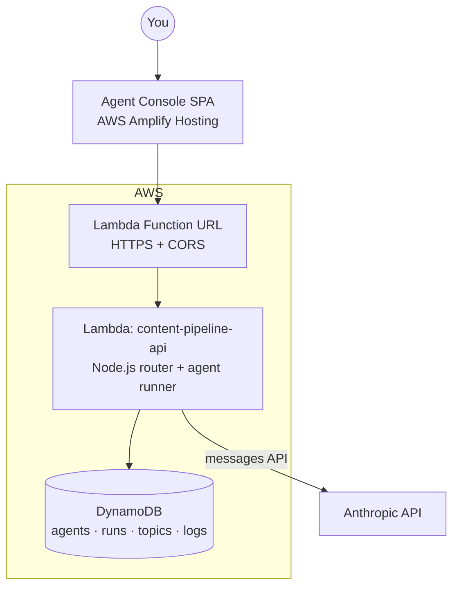

# Multi-Agent Content Pipeline — Agent Console

A serverless multi-agent system that turns voice-recorded brainstorms into polished, publication-ready content — with a web console to view, manage, and run the agents, plus a topic inventory to track post ideas from **idea → queued → discussed → published**.

Built on AWS: **Amplify Hosting** (UI) · **Lambda** (agent runner + API) · **DynamoDB** (configs, runs, topics, logs) · **Anthropic API** (Claude).

## How it works

**Pipeline:** Research Agent generates topic ideas → you pick one (tracked in the Topics inventory) → Talking Points Agent builds a recording glance-sheet → you record an unscripted voice note → Drafting Agent structures the transcript → Enrichment Agent adds data/examples (flagged for human approval) → QA/Tone Agent applies your voice and flags anything needing review.

Every hand-off is human-in-the-loop: agents run on demand, and each stage can load the previous stage's latest output.

## Features

- **Agents tab** — view each agent's work history, edit its config (topic domain, tone profile, format template) and prompt template live, enable/disable, and run with custom input.
- **Topics tab** — an inventory of post ideas with lifecycle statuses (idea/queued/discussed/published), one-click talking-points generation, timestamped notes, and a full activity log per topic.
- **Config-driven verticals** — the same pipeline serves different content verticals (professional, personal) by swapping config values, not code.
- **Zero-dependency deploys** — the Lambda uses only the bundled AWS SDK v3; the frontend is a single static HTML file.

## Repo layout

| Path | What it is |
|---|---|
| `lambda/index.mjs` | Entire backend: HTTP routing, agent runner, topic tracker, DynamoDB access |
| `site/index.html` | Entire frontend: agents console + topics inventory (no build step) |

## Deploy your own

1. **DynamoDB** — create table `content-pipeline` with partition key `pk` (String) and sort key `sk` (String), on-demand capacity.
2. **Lambda** — create a Node.js 22 function, paste/upload `lambda/index.mjs`, set timeout to 2 min, and add env vars:
   - `TABLE_NAME` = `content-pipeline`
   - `ANTHROPIC_API_KEY` = your key
   - `MODEL` = `claude-sonnet-4-5` (optional)
3. Give the Lambda's execution role DynamoDB access to the table (`GetItem, PutItem, UpdateItem, Query, Scan`).
4. Enable a **Function URL** (auth: NONE) with CORS: origin `*`, headers `content-type`, methods `*`.
5. **Frontend** — replace `__API_URL__` in `site/index.html` with your Function URL, zip it, and drag-drop into Amplify Hosting (manual deploy). Or open the file locally and set the URL in ⚙ API Settings.

On first request the API seeds five default agents (Research, Talking Points, Drafting, Enrichment, QA) configured for a professional LinkedIn/blog vertical — edit them in the console.

> ⚠️ The Function URL is public. For anything beyond personal use, add an auth token check in the Lambda.

## Origin

This project is self-documenting: the original spec was produced by voice-recording a brainstorm about the idea and running the transcript through the same kind of pipeline it describes.
